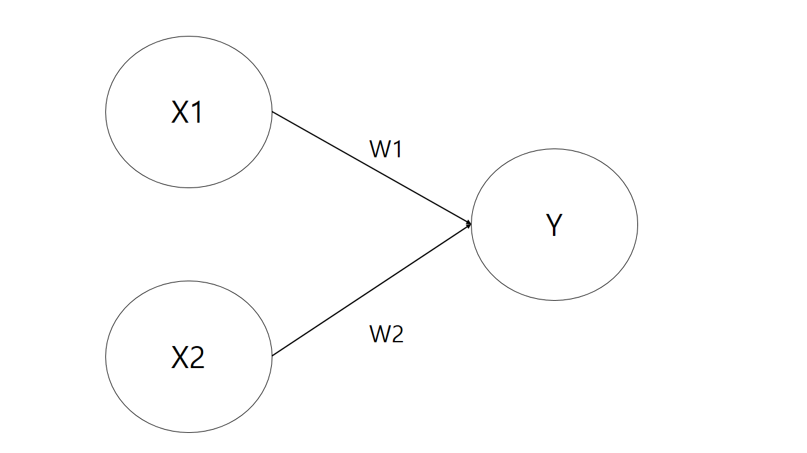
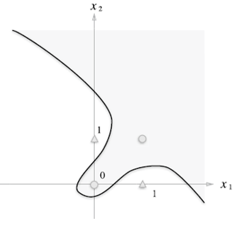
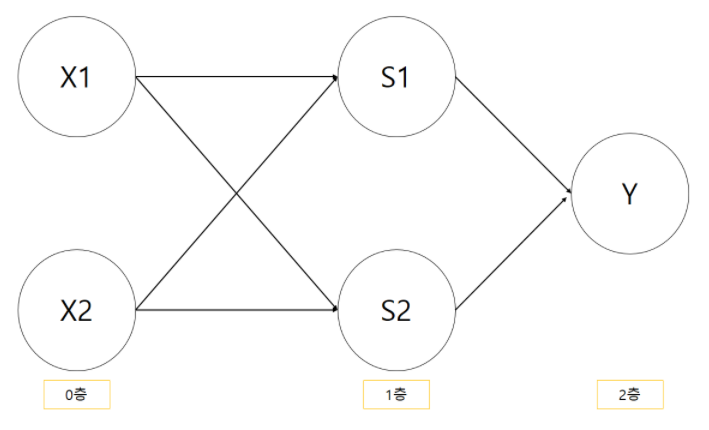
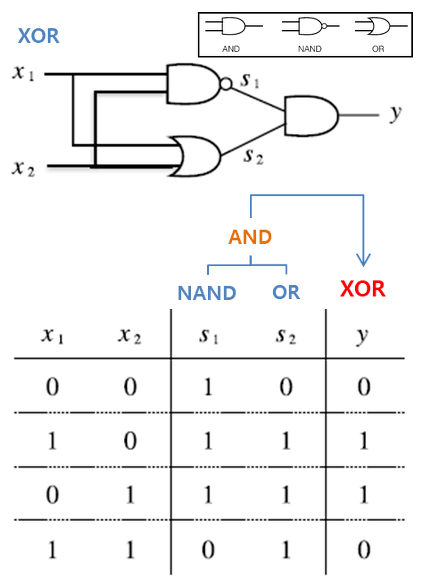

# Perceptron

- 신경망(딥러닝)의 기원이 되는 알고리즘
- 퍼셉트론의 구조를 배우는 것은 신경망과 딥러닝으로 나아가는데 중요한 아이디어를 배우는 일

## 퍼셉트론이란?

- 다수의 신호를 입력으로 받아 하나의 신호를 출력
- 신호도 흐름을 만들고 정보를 앞으로 전달
- 퍼셉트론의 결과 값 : `1(신호 흐름) or 0(신호 흐르지 않음)`

### 입력이 2개인 Perceptron



- X1, X2 : 입력신호
- Y : 출력신호
- W1, W2 : 가중치
- 원 : 뉴런 or 노드

- 뉴런에서 보내온 신호의 총합이 정해진 한계를 넘어설 때만 1을 출력 = `뉴런이 활성화 됨`
- 퍼셉트론은 복수의 입력신호 각각에 고유한 `가중치`를 부여
- 가중치는 각 신호가 결과에 주는 `영향력을 조절하는 요소`로 작용
- 가중치가 `클수록` 해당 신호가 그만큼 `더 중요`

### 퍼셉트론의 한계

- 선형 그래프는 쉽게 구현 가능: AND, NAND, OR
- 비선형 그래프는 불가능: XOR

#### AND

가중치 *w*와 편향 *b*를 설정한다.

```py
def AND(x1, x2):
  x=np.array([x1, x2])
  w=np.array([0.5, 0.5])
  b=-0.7

  tmp=np.sum(w*x)+b

  if tmp<=0:
    return 0
  else:
    return 1
```

#### XOR



## 다층 퍼셉트론: multi-layer perceptron

다층 퍼셉트론을 사용해서 비선형을 표현할 수 있다.



### 기존 Gate 조합으로 XOR 만들기



### 코드

```py
def XOR(x1, x2):
  s1 = NAND(x1, x2)
  s2 = OR(x1, x2)
  y = AND(s1, s2)
  return y
```

---

## 신경망

- 퍼셉트론: 사람이 **수동으로** 가중치를 설정해야 한다.
- 신경망: 가중치를 **자동으로 학습**한다

### 퍼셉트론 수식


### 활성화 함수: activation function


**다시:**

- 신호의 총합 affine: 
- 활성화 함수: 
- 출력: 

#### 종류

- 계단 함수: step function
- 시그모이드 함수: sigmoid function
- ReLU 함수: Rectified Linear Unit function

### 출력층

- 회귀 regression
  - 항등 함수 identify function: 입력을 그대로 출력
- 분류 classification
  - 소프트맥스 softmax: 출력 결과의 확률을 구함
    - 신경망을 학습 시킬 때 사용
    - 추론에서 생략 가능

---

## 손실 함수

- 학습: 가중치 매개변수의 최적값을 자동으로 획득하는 것
- 손실 함수의 결괏값을 가장 작게 만드는 가중치 매개변수 찾기
- 손실 함수는 매개변수의 변화가 잘 드러난다.
- 신경망의 성능을 나타내는 지표

### 종류

- 오차제곱합 sum of square for error
- 교체 엔트로피 오차 cross entropy error

### 사용하는 이유

- 정확도: 이산 값
  - 100개 중 32개 = 32%
  - 미분 값이 0이 나오면 가중치의 매개변수를 고칠 수 없음.
- 손실 함수: 연속적인 값
  - 0.92543...
  - 미묘한 변화로 신경망 학습이 이루어질 수 있다.

### 가중치를 수정하는 방법

- 경사 하강법: gradient descent
  1. 최적의 매개변수를 찾아야 한다.
  2. 손실 함수가 최솟값이 될 때.
  3. 기울기를 사용해 함수의 최솟값을 찾으러 갈 수 있다.
  4. 기울어진 방향으로 나아간다.
- 확률적 경사 학습법: stochastic gradient descent
  -  확률적으로 무작위로 골라낸 데이터에 대해 수행하는 경사 하강법
- 학습률 learning rate
  - 매개변수 갱신 수준
  - 하이퍼파라미터: 신경망의 매개변수와는 다른 매개변수. 학습률은 사람이 직접 설정한다.
  - 파라미터: 신경망이 훈련으로 찾아가는 값이다.

---

## 오차역전파법 backpropagation

- 가중치 매개변수의 기울기를 효율적으로 계산하는 방법
- 미분의 속도가 빨라진다.

---

## 학습 기술

### 가중치 갱신 방법

- 확률적 경사 하강법
- Momentum
- AdaGrad
- Adam

### 가중치 초깃값

- Xavier 초깃값
  - sigmoid, tanh
- He 초깃값
  - ReLU

### 배치 정규화 batch normalization

- 학습이 빨라진다.
- 초깃값에 의존하지 않는다.
- 오버피팅을 억제한다.
- Affine + Batch Norm + ReLU

### 과적합

- 가중치 감소 weight decay: 큰 가중치는 큰 페널티 부과
- 드롭아웃 dropout: 뉴런을 임의로 삭제

### 하이퍼파라미터

- 훈련 데이터: 매개변수 학습
- 검증 데이터: 하이퍼 파라미터 성능 평가
- 시험 데이터: 신경망의 범용 성능 평가

하이퍼 파라미터 최적화는 범위를 좁혀가며 빠르게 하는 것이 좋다.

---

## 합성곱 신경망 Convolutional Neural Network

- 합성곱 계층 convolutional layer: 데이터 형상 보존
  - padding, stride
- 풀링 계층 pooling layer: 압축


### 비교

#### 기존

- Affine - ReLU
- Affine - ReLU
- Affine - Softmax

### CNN

- Conv - ReLU - Pooling
- Conv - ReLU - Pooling
- Conv - ReLU
- Affine - ReLU
- Affine - Softmax
